# Course Project Report

**OJ-X Title:** Online Judge System

**Course:** Modern Programming Practices

**Block:** July 2025

**Instructor:** Dr. Bright Gee Varghese R

**Team Members:**

\[Vu Quynh Dinh]  \[619568]

**Date of Submission:** \[07/15/2025]

---

# Important Project Requirements Satisfied

**Stream API:**

Stream API is used extensively throughout the [project](https://github.com/quynhdinh/oj-x/commit/883701d862ea6d2ce78b79d9079d3dd7ee4bcaab) to process collections of data, such as filtering problems by difficulty, tags, and names, processing test case batches, mapping DTOs to display objects, aggregating submission statistics, and sorting and pagination operations.

**Unit Testing:**

The project includes unit tests for key business logic components.

Run the following command to execute the tests:
```bash
mvn test
```

**Singleton Pattern:**

The project implements the Singleton pattern in several key areas where a single instance is crucial for proper resource management and configuration consistency:

1. **DatabaseConfigManager** - Ensures only one instance manages database configuration, providing thread-safe access to database connection parameters loaded from the .env file.

2. **ApplicationLogger** - Centralizes logging configuration across the entire application, ensuring consistent log formatting and handling throughout all components.

3. **ApplicationSettings** - Manages application-wide configuration settings, providing a single source of truth for application properties and preferences.

These implementations use the double-checked locking pattern for thread safety and prevent cloning to maintain singleton integrity. The pattern is justified here because:
- Database configuration should be loaded once and shared across the application
- Logging configuration needs to be consistent application-wide
- Application settings should be centrally managed to avoid configuration conflicts 

---

## 1. Problem Description

This online judge system empowers users to enhance their programming skills through solving categorized problems and participating in contests. By providing a structured platform for practice and competition, it encourages continuous learning and skill development.

---

## 2. User Stories

Admin User Stories

* As an admin, I want to manage user accounts so that I can control access and ensure a safe environment.

* As an admin, I want to review submitted problems so that I can ensure they meet quality standards before they are published.

* As an admin, I want to set contest using problems that problem setter submitted and set points for each problems.

User User Stories

* As a user, I want to view and solve categorized programming problems so that I can practice specific skills and track my progress.

* As a user, I want to participate in coding contests so that I can challenge myself and compete with others.

* As a user, I want to receive instant feedback on my submissions so that I can learn from my mistakes and improve my coding skills.

* As a user, I want to manage my personal information by having a personal profile UI so that others know who I am

Problem Setter User Stories

* As a problem setter, I want to create and submit new problems so that I can contribute to the platform and help other users learn.

* As a problem setter, I want to set difficulty levels for problems so that users can choose challenges that match their skills.

* As a problem setter, I want to review user submissions for my problems so that I can provide insights and feedback on their solutions.

* As a problem setter, I want to categorize my problems so that users can easily find relevant challenges based on their interests.

---

## 3. Functional Requirements
User Management

    User Registration: Users must be able to create an account by providing necessary information (e.g., username, email, password).
  
    User Login/Logout: Users must be able to log in and log out securely.

    Profile Management: Users must be able to view and edit their profiles, including personal information and preferences.

Problem Management

    Problem Creation: Problem setters must be able to create programming problems which are later to be reviewed.
    
    Problem Categorization: Problems must be categorized by difficulty, topic, and tags for easy navigation.
    
    Problem Review: Admins must be able to review and approve problems before they are published.

Submission and Evaluation

    Code Submission: Users must be able to submit their code solutions for various problems.
    
    Automated Grading: The system must automatically compile and run submitted code against predefined test cases to evaluate correctness.
    
    Feedback and Results: Users must receive immediate feedback on their submissions, including whether their solution is correct and performance metrics.

Contests

    Contest Creation: Admins must be able to create and manage coding contests, including setting time limits and problem sets.
    
    Contest Participation: Users must be able to register for and participate in contests.
    
    Leaderboard: The system must maintain a leaderboard displaying participant rankings based on their performance in contests.

---

## 4. Non-Functional Requirements
Usability

    User Interface: The system must have an intuitive and user-friendly interface accessible to users with varying technical skills.

Availability

    Uptime: The system must have an uptime of 99.9% to ensure continuous access for users.
---

## 5. Architecture of Project

### 5.1 Overview

I follow a layered architecture pattern, which separates concerns and promotes maintainability.


### 5.2 Architecture Diagram

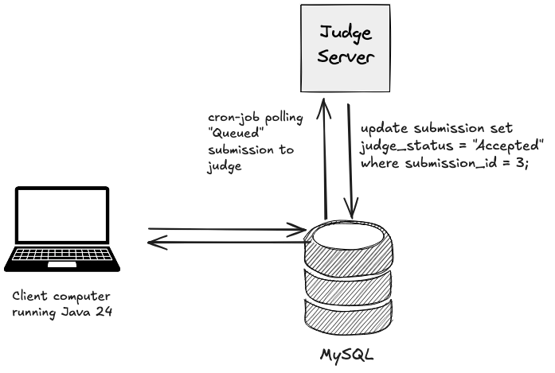

### 5.3 Technologies Used

List all major technologies (e.g., Java 24, MySQL, Maven).

### 5.4 Layer Descriptions

* **Presentation Layer:** Responsible for handling user interactions and displaying information. It includes web pages, UI components, and API endpoints. The files associated with this layer are the ones prefix Controller, such as `HomeScreen`, `UserScreen`, `ProblemScreen`, and `ContestScreen`.
* **Service Layer:** Contains the business logic of the application. It processes user requests, interacts with the data access layer, and enforces business rules. The files associated with this layer are the ones prefix Service, such as `UserService`, `ProblemService`, and `ContestService`.
* **Data Access Layer:** Manages database interactions. It provides an abstraction over the database and handles CRUD operations. The files associated with this layer are the ones prefix Repository, such as `UserRepository`, `ProblemRepository`, and `ContestRepository`.
* **Database:** The underlying data storage system here is MySQL where all application data is persisted.

---

## 6. Use Case Diagram(s)

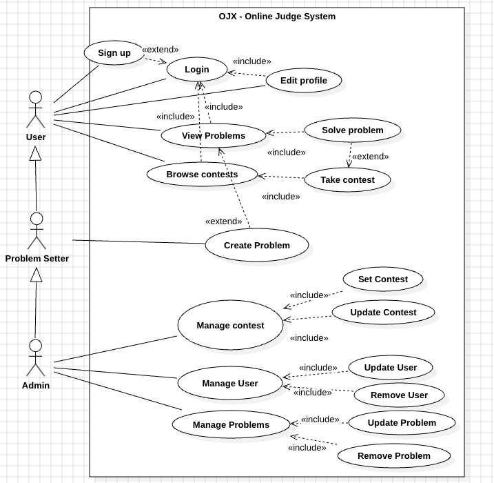
---

## 7. Use Case Descriptions

Provide detailed descriptions for some important use cases:

7. 1
* **Use Case Name:** User Submit Problem
* **Primary Actor(s):** User
* **Preconditions:** User is logged in and has navigated to the problem submission page.
* **Postconditions:** User's submission is recorded, and feedback is provided.
* **Main Success Scenario:**
  1. User selects a problem to solve.
  2. User writes code in the provided editor.
  3. User clicks the "Submit" button.
  4. System validates the submission and runs tests.
  5. System provides feedback on the submission.
7. 2
* **Use Case Name:** Admin Manage User Accounts
* **Primary Actor(s):** Admin
* **Preconditions:** Admin is logged in and has access to the user management interface.
* **Postconditions:** User accounts are updated, and changes are reflected in the system.
* **Main Success Scenario:**
  1. Admin navigates to the user management section.
  2. Admin views a list of registered users.
  3. Admin selects a user to manage.
  4. Admin can edit user details, deactivate accounts.

7.3
* **Use Case Name:** User Participate in Contest
* **Primary Actor(s):** User
* **Preconditions:** User is logged in and contests are available.
* **Postconditions:** User's participation is recorded, and contest results are updated.
* **Main Success Scenario:**
  1. User navigates to the contest page.
  2. User selects a contest to participate in.
  3. User can solve problems only if the contest is ongoing.

---

## 8. Class Diagram

The OJ-X system follows a layered architecture with clear separation of concerns. Below is the comprehensive class diagram showing key classes, their attributes, methods, and relationships:

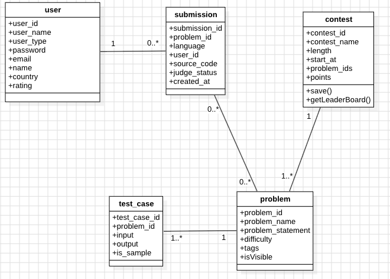

### 8.1 Architecture Layers

#### Model Layer
The core business entities representing the domain objects:

- **User**: Represents system users (admin, problem setter, regular user) with Builder pattern implementation
- **Problem**: Programming problems with associated metadata (difficulty, tags, statement)
- **Contest**: Programming contests containing multiple problems with timing and scoring
- **Submission**: User code submissions with judge status and metadata
- **TestCase**: Input/output test cases for problems, with Builder pattern implementation
- **JudgeStatus**: Enumeration for submission statuses (AC, WA, TLE, MLE, RE, CE)

#### Service Layer (Business Logic)
Interface-based services implementing business rules:

- **UserService/UserServiceImpl**: User management, authentication, profile operations
- **ProblemService/ProblemServiceImpl**: Problem CRUD operations, filtering, visibility management
- **ContestService/ContestServiceImpl**: Contest management and participation
- **SubmissionService/SubmissionServiceImpl**: Code submission handling and result management
- **TestCaseService/TestCaseServiceImpl**: Test case management for problems

#### Repository Layer (Data Access)
Data access objects handling database operations:

- **UserRepository**: User data persistence and queries
- **ProblemRepository**: Problem data management with complex filtering
- **ContestRepository**: Contest data operations
- **SubmissionRepository**: Submission data with pagination support
- **TestCaseRepository**: Test case batch operations

#### Configuration Layer (Singleton Pattern)
Centralized configuration management using Singleton pattern:

- **DatabaseConfigManager**: Singleton for database configuration management
- **ApplicationLogger**: Singleton for centralized logging across the application
- **ApplicationSettings**: Singleton for application-wide settings
- **ConnectionManager**: Database connection management using DatabaseConfigManager

#### GUI Layer
User interface components following MVC pattern:

- **HomeScreen**: Main user dashboard
- **ProblemsetScreen**: Problem browsing and filtering interface
- **ContestScreen**: Contest listing and participation
- **SubmissionScreen**: Submission history and status tracking
- **CreateProblemScreen**: Problem creation interface with nested TestCaseInputPanel
- **ViewProblemScreen**: Problem details and submission interface
- **Admin Screens**: Administrative interfaces for user, problem, and contest management

### 8.2 Key Design Patterns

- **Singleton Pattern**: DatabaseConfigManager, ApplicationLogger, ApplicationSettings
- **Builder Pattern**: User.Builder, TestCase.Builder for complex object construction
- **Repository Pattern**: Data access abstraction layer
- **MVC Pattern**: Separation of GUI, business logic, and data layers
- **Interface Segregation**: Service interfaces separate from implementations

### 8.3 Key Relationships

- **User** creates multiple **Submissions** (1:N)
- **Problem** has multiple **TestCases** (1:N) 
- **Problem** receives multiple **Submissions** (1:N)
- **Contest** includes multiple **Problems** (M:N through problemIds string)
- **Service** implementations depend on **Repository** classes
- **Repository** classes use **ConnectionManager** for database access
- **ConnectionManager** uses **DatabaseConfigManager** singleton
- **GUI** components depend on **Service** interfaces

### 8.3 Stream API Usage

The system extensively uses Java Stream API for collection processing:
- Filtering problems by difficulty, tags, and names
- Processing test case batches
- Mapping DTOs to display objects
- Aggregating submission statistics
- Sorting and pagination operations

---

## 9. Sequence Diagrams
Here are the sequence diagrams for key use cases in the OJ-X system:

Save Problem

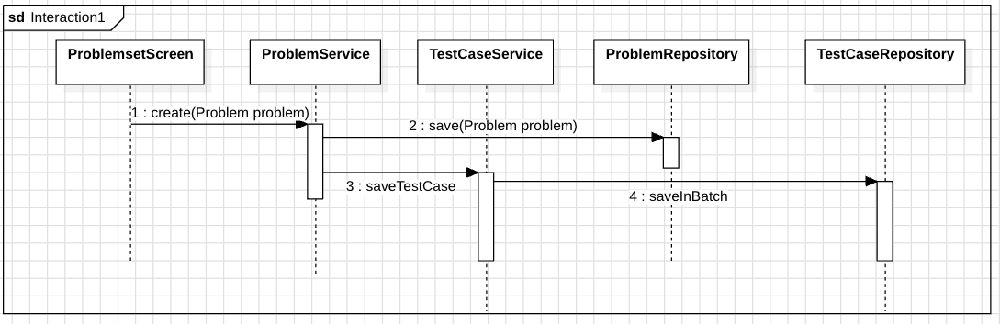

Submit Problem

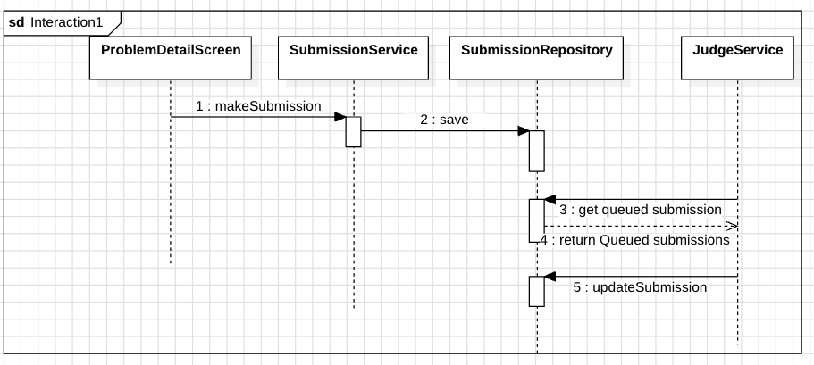

---

## 10. Screenshots

User can log in / Sign up to the system
Login Screen             |  Sign up Screen
:-------------------------:|:-------------------------:
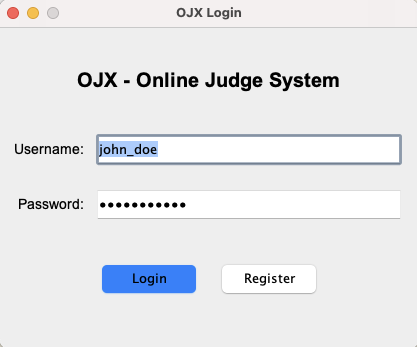  |  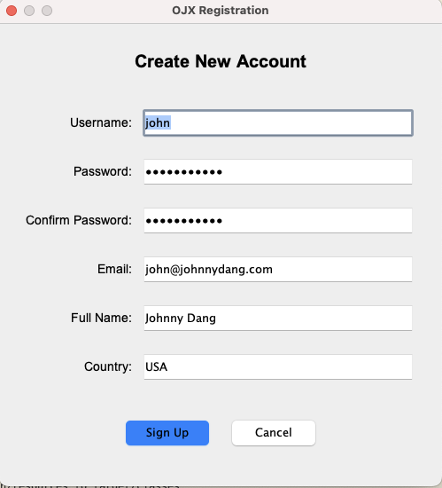

Easy to use UI for users
User/Problem Setter Home Screen             | Admin Home Screen
:-------------------------:|:-------------------------:
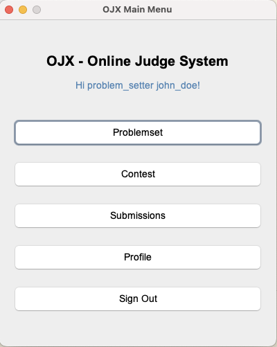  |  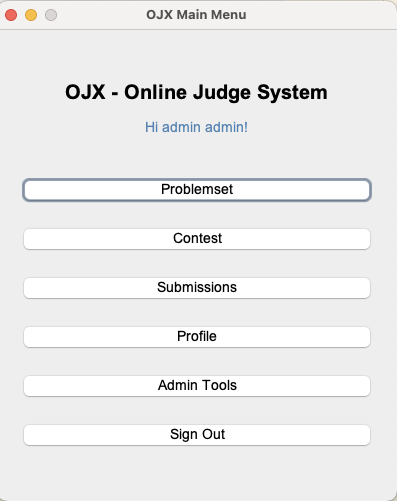

User can participate in contests
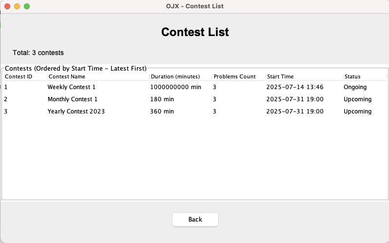

User can browse problems to solve

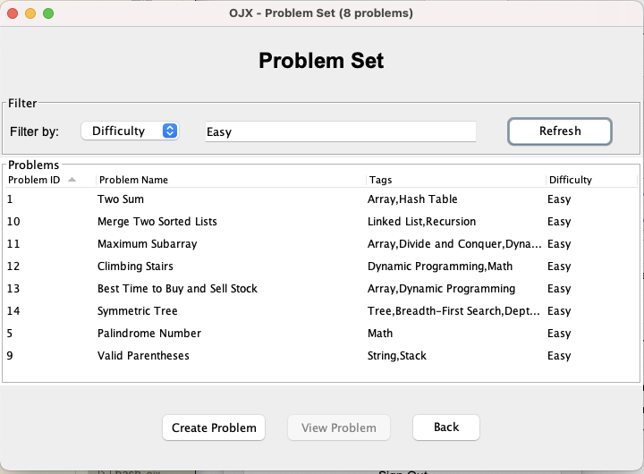

User can see submissions of any one using the system
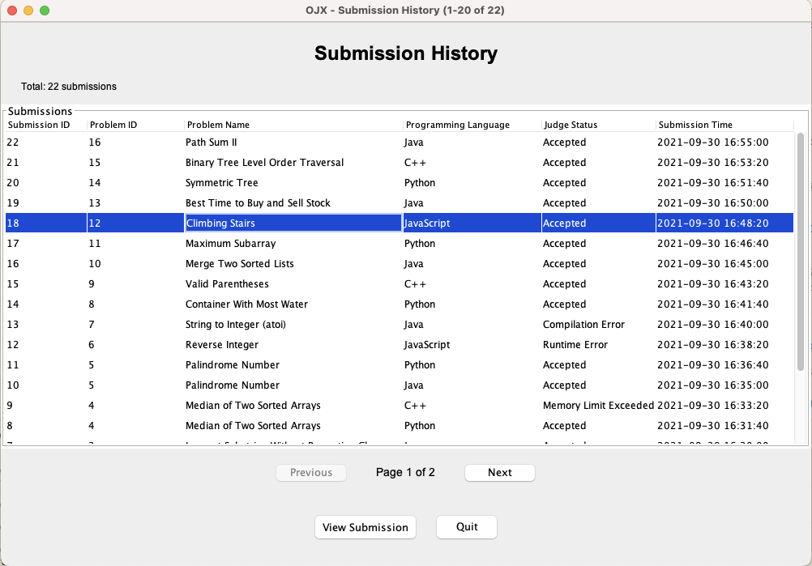

Admin panel for managing users, problems, and contests

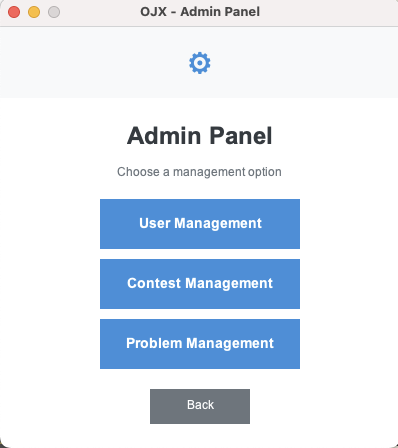
---

## 11. Installation & Deployment
The repository is hosted on GitHub at [oj-x](https://github.com/quynhdinh/oj-x)

Development environment setup instructions:

1. Cloning the repository
2. Setting the environment variables located in the file `ojx/src/main/resources/application.properties/.env`. We need 3 variables
   * `DB_URL`: The URL to connect to the MySQL database, e.g., `jdbc:mysql://localhost:3306/ojx`

   * `DB_USERNAME`: The username to connect to the database

   * `DB_PASSWORD`: The password to connect to the database
  
* Move to project directory `ojx` `cd ojx`
* Run script to run the application `./run.sh`

---

## 12. How to Use
The application database is hosted on MySQL and deployed using a running instance. All you have to do is to have your machine running Java 24 and Maven installed.

Download `the jar` file from [here](https://github.com/quynhdinh/oj-x/releases/download/v1.0/ojx-1.0.jar) and running the following command:
```bash
java -jar ojx-1.0.jar
```

---

## 13. Design Justification & Principles

Explain your key design choices, such as:

1. Use of interfaces, abstract classes, inheritance (Liskov Substitution Principle), composition.
   * The system uses interfaces for services (e.g., `UserService`, `ProblemService`) to define contracts for business logic operations.
   * The UI of some Admin screens `extends` screens from regular users to reuse common functionality and ensure consistent behavior. 
2. Application of Open-Closed Principle.
   * The system uses interfaces for services (e.g., `UserService`, `ProblemService`) to allow easy extension without modifying existing code.
   * New features can be added by implementing new service classes or extending existing ones without changing the core logic.
   * The system is designed to be modular, allowing new features to be added as separate modules or services without affecting existing functionality.
3. Design patterns: 
   * Singleton: `ApplicationLogger`, `DatabaseConfigManager`, `ApplicationSettings` to ensure single instances for logging, database configuration, and application settings.
   * Builder: The project using the Builder pattern to create complex objects like `User`, `Problem`, and `Contest` to ensure immutability and ease of construction.

---

## 14. Team Members

\[There is only me in this project, so I will not include this section]

---

## 15. References
* Lecture notes
* Lecture sample code
* Online resources for Java Stream API, Singleton pattern, and Builder pattern

---
## Grading Rubric (Total: 10 Points)

| Criteria                                     | Points | Description / Expectations                                                                                   |
| -------------------------------------------- | :----: | ------------------------------------------------------------------------------------------------------------ |
| **Problem Description & User Stories**       |    1   | Clearly states the problem and provides meaningful, relevant user stories.                                   |
| **Functional & Non-Functional Requirements** |    1   | Functional and non-functional requirements are complete, clear, and relevant.                                |
| **Architecture & Design**                    |    1   | Well-structured layered architecture, clear diagrams (class, sequence, use case), thoughtful design.         |
| **Use of Stream API**                        |    1   | Appropriately uses Java Stream API wherever possible; usage is clear and well-documented.                    |
| **Singleton Pattern (when applicable)**      |    1   | Applies the Singleton pattern where necessary; justification provided in documentation.                      |
| **Unit Testing**                             |    1   | Implements unit tests for key business logic; tests are meaningful and cover main cases.                     |
| **Implementation Quality**                   |    1   | Code quality: modularity, clean structure, meaningful naming, adherence to SOLID principles, error handling. |
| **Deployment, Installation & Usability**     |    1   | Clear setup instructions, successful deployment, working UI/CLI, and usability.                              |
| **Documentation & Reporting**                |    1   | Detailed README: all sections complete (screenshots, diagrams, instructions, principles, references, etc).   |
| **Presentation & Teamwork**                  |    1   | Professionalism in presentation (repo, submission, screenshots), teamwork (if applicable), and originality.  |
| **Total**                                    | **10** |                                                                                                              |
